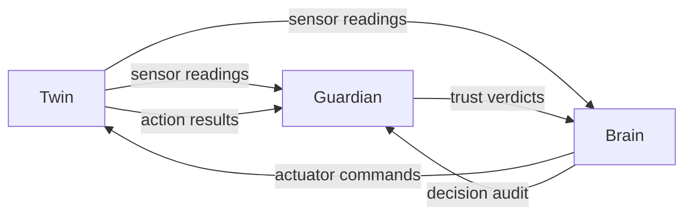

# Integration plan — pending team agreement

This is a proposed data flow, not an agreed protocol. Decide transport, message versioning, authentication, ordering/timeouts, trust gating, retries, and safe behavior when a partner is unavailable. Record decisions in `docs/decisions/`.

Partner addresses must be configurable. Keep domain logic separate from transport adapters. Validate incoming messages, report clear errors, and use correlation IDs and UTC timestamps across the live timeline and logs.

`contracts/examples/` contains synthetic examples. `scaffold-smoke` demonstrates their sequence offline; it is not evidence of a successful joint service run. Replace or extend it with real triggers once services exist. Record actual joint runs in `docs/collaboration.md`.
